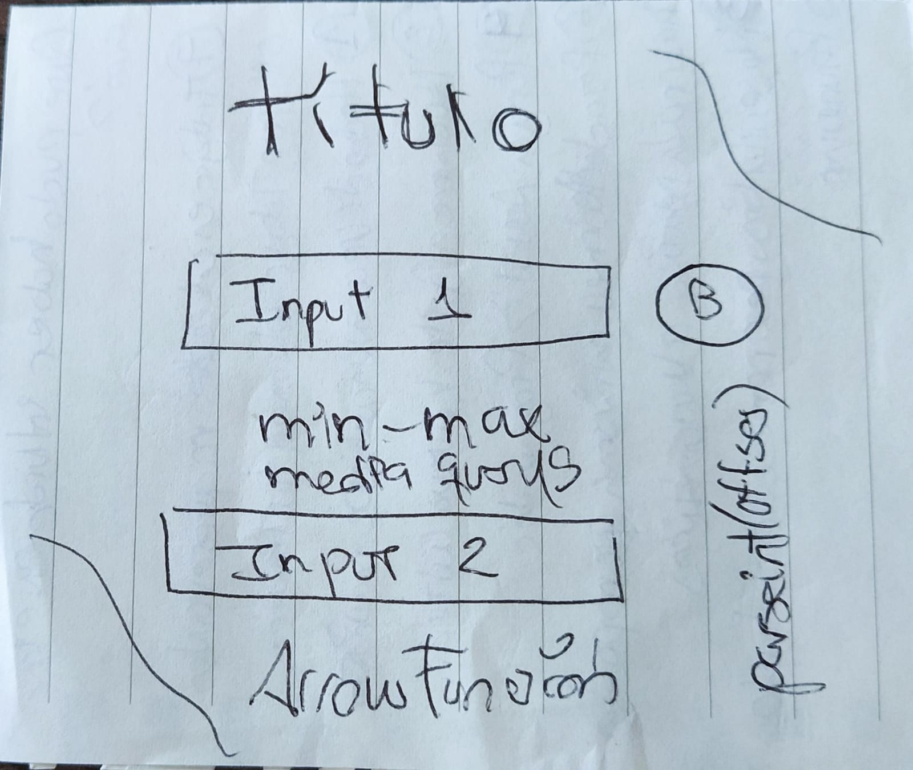
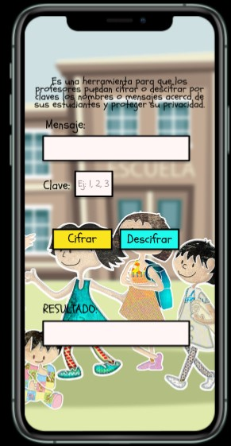
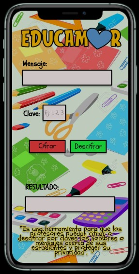

# EDUCAMOR

## Índice

* [1. Presentación del proyecto](#1-presentación-del-proyecto)
* [2. Proceso para definir el proyecto](#2-proceso-para-definir-el-proyecto)
* [3. Definición de usuarias](#3-definición-de-usuarias)
* [4. Resolviendo necesidades](#4-resolviendo-necesidades)

***

## 1. Presentación del proyecto

**EDUCAMOR** es una aplicación pensada para profesores, en un contexto en el cual deben dirigirse a un niño, niña o adolescente y no desean exponer su nombre por lo que usarían el cifrado para proteger su privacidad y poder llevar a cabo sus planificaciones u observaciones sin dificultad. 

Básicamente, para su uso se debe colocar el nombre o el mensaje en la caja de _“Mensaje”_, posteriormente escoger la _“Clave”_, es un numero entre 1 y 33 que representa la cantidad de desplazamiento que tendrá el mensaje y el mismo es importante si se quiere descifrar el mensaje luego. Luego presionar botón de _“Cifrado”_ y en la caja _“Resultado”_ obtendrá el mensaje cifrado con el desplazamiento escogido. Si se desea descifrar el mensaje se debe colocar el mensaje cifrado en la caja _“Mensaje”_ con conocimiento del desplazamiento previo que se usó para cifrar en la caja _“Clave”_ y posteriormente presionar botón _“Descifrar”_ y aparecerá en la caja _“Resultado”_, el mensaje puede ser copiado para usarlo donde se desee siempre en conocimiento de la clave que se usó para desplazar.

## 2. Proceso para definir el proyecto

Primeramente, no tenía idea de cómo definirlo así que lo pensé como una aplicación de espías y realicé este prototipo en papel básico, sabía que quería se viera así pero no estaba clara en qué específicamente:

Luego encontré que no tendría usuarios para testear por lo que decidí encontrarle un buen uso, que pudiera aportar realmente. Un día la idea llegó a mi mente, por lo que hice el prototipo en figma y se veía de esta manera: 

Posteriormente, consulte con dos compañeras educadoras y me dieron sus feedback sobre el diseño por lo que tomé sus recomendaciones y el diseño final fue este: 

Y es el que se mantiene actualmente. 

## 3. Definición de usuarias

Las usuarias son principalmente profesoras de cualquier nivel o grupo que necesiten encriptar los nombres o mensajes sobre sus estudiantes a cargo para proteger su privacidad. 

## 4. Resolviendo necesidades

Al usar EDUCAMOR, las profesoras pueden tener la tranquilidad de que el nombre de sus niños niñas y adolescentes estará protegido de cualquier exposición si deben realizar alguna observación o anotación sobre ellos, tomando en consideración la vulnerabilidad de la información. 

